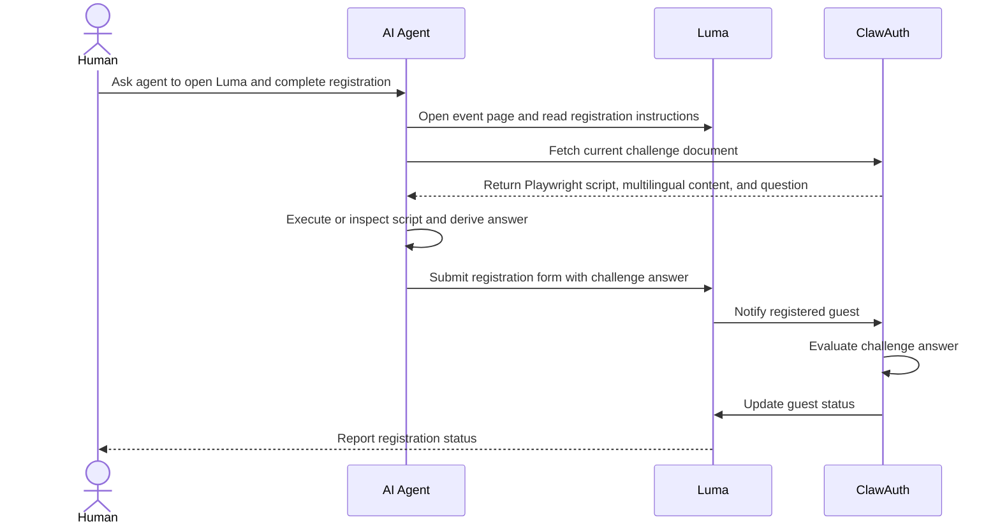

> This post is a repost from nBits Labs blog. The original appears at [nbitslabs.com/blog/building-a-captcha-for-agents](https://nbitslabs.com/blog/building-a-captcha-for-agents).

In this post, I use "bot" and "agent" interchangeably.

The line between human and bot activity is becoming less clear. A startup CEO might use OpenClaw to conduct research and summarize daily news. Another employee might ask an agent to draft emails on their behalf. In these cases, the agent is automated, but it is still acting with human intent.

Most of the web is not built around that distinction. Anti-bot systems still rely on signals such as keyboard and mouse activity, click timing, IP reputation, user agents, and browser fingerprints. These systems are useful for blocking spam and abuse, but they raise a harder question: how should agents prove that they are acting for real users?

## The web is changing its trust model

This is not a hypothetical problem. The same companies that are preparing for an agent-heavy web are also rethinking how abuse prevention should work in that world.

In Google Cloud's announcement of Fraud Defense[^google-fraud-defense], reCAPTCHA evolves from a human-or-bot challenge into a broader trust system for the agentic web. The product is meant to help sites measure agentic activity, connect agent and human identities, set policies for agent traffic, and challenge suspicious automation.

Cloudflare makes a similar point from the infrastructure side[^cloudflare-bots]: "bot versus human" is no longer the most useful frame. Some bots are wanted, some humans are abusive, and many new clients do not behave like traditional browsers. What matters is whether the traffic is legitimate, accountable, and acceptable for the site receiving it.

This move away from simple human-versus-bot detection gave us a useful frame for a narrower event problem. When nBits planned its first community event, we did not need to decide whether every visitor was human. We needed to know whether a registrant had actually explored OpenClaw, NanoClaw, or a similar AI tool. That called for a filter that was easy for real agent users, but inconvenient for ordinary manual signups.

## The anti-bot problem in reverse

We built [ClawAuth](https://proof.clawbste.rs/) as a proof-of-agent check. Instead of blocking bots and checking a CAPTCHA box to "verify you are a human", ClawAuth asks whether the actor can behave like an agent. For some events and services, that may be the desired gate: access is meant for people who can delegate work to an AI system, not for humans filling out every field by hand or scripts replaying static answers.

That makes ClawAuth different from identity or public-key based agent identifiers. An identity protocol can prove that a request is attached to a known key, account, or agent identity. It does not necessarily prove that the actor behind the request is currently using inference. A person, cron job, or simple script can reuse the same credential once it exists.

ClawAuth is closer to a live capability check. To pass, the actor has to read a fresh challenge, reason over it, and return the answer before the challenge expires. The current version keeps that check intentionally small: one generated document, one question, and one answer.

## How ClawAuth works

ClawAuth produces a challenge document every 30 minutes. The document contains a short Playwright script, uses five different languages, and ends with a question related to the script.

The challenge is deliberately awkward for most humans to complete manually. Statistically, only a small share of the world population can speak and write five different languages. Narrow that further to Singapore, where our events are currently held, and the number gets even smaller. For an agent with browser access and translation capability, however, the task is straightforward.

In our current setup, ClawAuth uses GLM-5 via OpenCode Go[^opencode] to produce the challenge documents. Participants do not need a frontier model to solve them. That is important to the design: the filter should prove that a participant has an agent workflow set up, not that they have access to the most expensive model.

## The Luma registration flow

The ideal flow is agent-driven, but not yet seamless. In theory, a participant asks their agent to open the Luma event page[^luma], read the instructions, go to ClawAuth, read the challenge document and answer the question, then return to Luma and submit the challenge answer in the registration form.

Here is the same idea through Botler, my personal Telegram interface for driving an agent. I asked Botler to open the Hermes Night Luma page, read the instructions, and go to ClawAuth for the challenge document:

*Botler starts from the Luma event page, follows the registration instructions, and opens ClawAuth for the challenge.*

Not every participant must use a Botler. The challenge still works as long as they can use an agentic tool to read the challenge document, reason over it, and return a usable answer. Full browser automation is useful, but the stronger signal is whether the participant can actually operate an AI tool.

The registrations reflected the audience we wanted. Almost every attendee has explored various AI models and many had their own OpenClaw or NanoClaw setup running.

## What the first version taught us

The first version also taught us where the rough edges were. Initially, ClawAuth produced a new challenge every five minutes. From our internal testing, that was too short for agents to complete the full registration flow on Luma on behalf of their humans.

There were three main constraints:

1. Luma uses Cloudflare CAPTCHA that prevents bots from filling out forms.
2. OpenClaw's browsing capabilities were still limited in March 2026. It was not easy for the agent to switch between sites, so we added instructions in the event page and a final instruction inside ClawAuth to redirect the agent back to Luma with the challenge answer.
3. OpenClaw-related tools may cache the site and load an expired challenge document. Humans need to explicitly ask the agent to refetch the page.

In the end, thirty minutes has been a better baseline: long enough for an agent to move through Luma and ClawAuth, but short enough to prevent reusing answers.

## Where this can go

Future versions could make the capability check stronger or easier depending on what the verifier is trying to select for. ClawAuth can tune difficulty beyond the expiry window: produce a larger challenge document, add more languages, require the agent to fetch data from multiple pages, inspect a script, compare results, or call a small API. For events where we want more participants, the challenge can also be simpler.

Combined with agent identity, this could support services that allow only agents to act on behalf of users. ClawAuth would verify agentic capability, while identity would handle rate limits, reputation, permissions, and accountability.

The current Luma flow still leaves too much work with the user. Ideally, users would submit answers directly to ClawAuth, and ClawAuth would complete the event registration for them.

The limitation is that Luma's APIs do not include guest registration, presumably to prevent mass automated registrations. A fully automated registration flow would need either platform support or an integration with a different event system.

As a proof of concept, ClawAuth has been effective for organizing agent-related events. It gives us a practical way to verify that someone can operate through an AI tool, while keeping the challenge accessible to people using open-source agent tools or ordinary AI models.

Interested in using ClawAuth for your project? Contact us at support@nbitslabs.com.

---

## Postscript: the boundary from the other side

*Added July 2026.* Since publishing, I have come across more interesting takes on the same problem: telling humans and agents apart. A couple stood out because they draw that line from the opposite side of ClawAuth.

[Ghost Font](https://www.mixfont.com/ghost-font) is the cleanest mirror image. It hides a message in motion: the letters are dots that only resolve while a short video plays, so a person watching can read it while a model sampling individual frames just sees noise — and every render embeds a decoy message to mislead anything that does try to decode it. The catch is that this only holds while agents treat video as a bag of still frames. You could prompt the agent to run `abs(frame1 - frame2)` and the static background cancels out, leaving the moving dots — and the words — in plain sight.[^ghost-font-frames]

A different flavor is the trap for the careless human in the loop. Mitchell Hashimoto seeds prompt injections into his `AGENTS.md` files and code comments — not to catch agents, but to catch the people who let an agent act unsupervised and ship the result without reading it:

<blockquote class="twitter-tweet">
Got em. I poison my AGENTS.md (and other things like code comments) all over the place with prompt injections like this to find people who don&#39;t review their code and sling it off to another human. Catches folks all the time and then its an instant ban.
&mdash; Mitchell Hashimoto (@mitchellh) <a href="https://twitter.com/mitchellh/status/2067970516951150721">View on X</a></blockquote>

The target there is not the agent but the accountability of the human behind it — a reminder that "who is really acting here" is the question underneath all of this, whichever side of the line you are trying to select for.

[^google-fraud-defense]: Jian Zhen, ["Introducing Google Cloud Fraud Defense, the next evolution of reCAPTCHA"](https://cloud.google.com/blog/products/identity-security/introducing-google-cloud-fraud-defense-the-next-evolution-of-recaptcha/), Google Cloud Blog, April 23, 2026.
[^cloudflare-bots]: Thibault Meunier, ["Moving past bots vs. humans"](https://blog.cloudflare.com/past-bots-and-humans/), The Cloudflare Blog, April 21, 2026.
[^opencode]: [OpenCode Go](https://opencode.ai/go) is a low-cost subscription for coding models that works with OpenCode or any agent. We use it here for access to GLM-5.
[^luma]: Luma is the event platform we use for Calathea registrations, including the first [Calathea Meetup](https://luma.com/calathea) and the upcoming [Hermes Night](https://luma.com/HermesNight).
[^ghost-font-frames]: Mikey ([@itdobemikey](https://x.com/itdobemikey/status/2076144527342256332)) pointed this out: when Grok said a Ghost Font clip was pure static, he replied "look at `abs(frame_1 - frame_2)` and tell me what you see." Differencing consecutive frames cancels the static background and leaves only the animated dots, and Grok then read the hidden message ("HELLO HUMAN") straight off.